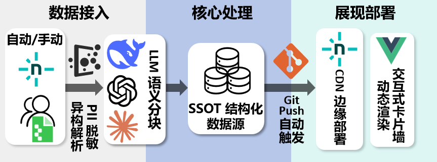

<p align="center">
  
</p>

# BUPT 访学指南 — 维护手册

基于 [VitePress](https://vitepress.dev) 的静态文档网站，汇聚北邮历届交流访学同学的问卷经验。数据以结构化 JSON 为单一数据源（SSOT），LLM 生成摘要、标签和原文摘录（exact_quote），原始文本 100% 保真；前端通过 Vue 组件异步渲染为可筛选的经验卡片墙，弹窗内原文高亮对应的摘录片段。Netlify 持续部署。

**内容更新只需三步**：换 CSV → 跑脚本 → 推代码。

---

## 目录

1. [技术栈速览](#1-技术栈速览)
2. [项目结构](#2-项目结构)
3. [环境准备（一次性）](#3-环境准备一次性)
4. [本地开发](#4-本地开发)
5. [内容更新三步流](#5-内容更新三步流)
6. [手动编辑页面](#6-手动编辑页面)
7. [数据流与架构](#7-数据流与架构)
8. [首次部署：GitHub 仓库与 Netlify](#8-首次部署github-仓库与-netlify)
9. [验证 Netlify 部署](#9-验证-netlify-部署)
10. [常见问题排查](#10-常见问题排查)
11. [进阶：修改 LLM 提示词](#11-进阶修改-llm-提示词)
12. [进阶：增加新的分类页面](#12-进阶增加新的分类页面)
13. [Netlify Forms 数据回收流程](#13-netlify-forms-数据回收流程)

---

## 1. 技术栈速览

| 层级 | 技术 | 用途 |
| --- | --- | --- |
| 文档框架 | VitePress 1.6 + Vue 3.5 | 静态站点生成、主题、搜索 |
| ETL 脚本 | Python 3 + pandas | 读取 CSV、脱敏、调用 LLM、写入 Markdown |
| LLM | DeepSeek（默认）/ Kimi / OpenAI | 提炼问卷摘要、发现关键词 |
| 部署 | Netlify | 自动构建，push 即部署 |

---

## 2. 项目结构

```
bupt-visiting-guide/
├── .env.example                  # API Key 配置模板
├── .env                          # 本地 API Key（gitignore）
├── .gitignore
├── package.json                  # Node 依赖（VitePress, Vue）
├── netlify.toml                  # Netlify 构建与缓存规则
│
├── data/
│   └── raw/                      # 问卷 CSV（gitignore，不上传仓库）
│       └── .gitkeep
│
├── docs/                         # 网站内容根目录
│   ├── index.md                  # 首页（Hero + Feature 卡片）
│   ├── pre-departure/
│   │   ├── index.md              # 手写概览 + ExperienceWall 组件
│   │   ├── registration-and-credits.md
│   │   └── packing-checklist.md
│   ├── academics/
│   │   ├── index.md              # 手写概览 + ExperienceWall 组件
│   │   ├── course-selection.md
│   │   └── lab-and-research.md
│   ├── life-and-mindset/
│   │   ├── index.md              # 手写概览 + ExperienceWall 组件
│   │   ├── daily-life.md
│   │   └── mental-health.md
│   ├── contribute/
│   │   └── index.md              # 经验征集页（Netlify Forms + 静态桩）
│   ├── resources/
│   │   └── index.md              # 资源导航页（校园/学习/开发/检索常用链接）
│   └── public/data/
│       └── experiences.json      # 经验数据库（SSOT，ETL 增量写入）
│
├── scripts/etl/                  # Python ETL 管道
│   ├── run.py                    # 入口脚本
│   ├── config.py                 # 路径、LLM provider 配置
│   ├── extract.py                # CSV 读取 + PII 脱敏
│   ├── transform.py              # LLM 语义分块（summary + exact_quote + tags + category）
│   ├── load.py                   # 增量追加写入 experiences.json
│   ├── fetcher.py                # Netlify Forms API 拉取 + 附件下载
│   ├── parser.py                 # 附件文本提取（TXT / PDF / DOCX）
│   ├── requirements.txt
│   └── prompts/
│       └── row_extraction.txt    # 语义分块提示词
│
└── .vitepress/
    ├── config.mts                # 导航、侧边栏、搜索配置
    └── theme/
        ├── index.ts              # 注册 ExperienceForm、ExperienceWall 组件
        └── components/
            ├── ExperienceForm.vue  # Netlify Forms 经验征集表单
            └── ExperienceWall.vue  # 经验卡片墙（异步加载 + 标签筛选）
```

### 文件生成关系

```
data/raw/*.csv  (or Netlify API via fetcher.py)
    │
    ▼  extract.py（读取 + 脱敏）
    │
    ▼  transform.py（LLM 语义分块：每条回答 → 0~3 个维度块，含 summary + exact_quote + tags + category）
    │
    └──▶ docs/public/data/experiences.json  （增量追加 + source_hash 去重）
              │
              ▼  ExperienceWall.vue（客户端 fetch + 标签筛选卡片墙）
```

---

## 3. 环境准备（一次性）

### 3.1 安装 Node.js（≥ 20）

从 [nodejs.org](https://nodejs.org) 下载 LTS 版本并安装。推荐使用 22.x。

### 3.2 安装前端依赖

```bash
npm install
```

### 3.3 创建虚拟环境并安装 Python 依赖

```bash
# 创建虚拟环境（仅首次）
python -m venv .venv

# 激活虚拟环境
.venv\Scripts\activate        # Windows (CMD)
.venv\Scripts\Activate.ps1    # Windows (PowerShell)
source .venv/bin/activate     # macOS / Linux

# 激活后即可直接使用 python / pip，无需带路径前缀
pip install -r scripts/etl/requirements.txt
```

> **日常操作提示**：激活虚拟环境后，后续所有 `python`、`pip` 命令都自动指向 `.venv` 内的版本，无需再写 `.venv/Scripts/` 前缀。关闭终端后需重新激活。

### 3.4 配置 LLM API Key

项目已包含 `.env.example` 作为模板。如果还没有 `.env` 文件，复制一份：

- **Windows（PowerShell）**：`Copy-Item .env.example .env`
- **Windows（CMD）**：`copy .env.example .env`
- **Mac / Linux**：`cp .env.example .env`

然后用文本编辑器打开 `.env`，在等号右侧填入你的 API Key。例如：

```ini
# .env 文件内容示例
LLM_PROVIDER=deepseek
DEEPSEEK_API_KEY=sk-你的真实key填在这里
KIMI_API_KEY=
OPENAI_API_KEY=
```

你要填的就是 `DEEPSEEK_API_KEY=` 等号右边那一串，把 `sk-你的真实key填在这里` 替换为你的真实 Key。其他两行用不上可以留空。

- **DeepSeek**（默认）：在 [platform.deepseek.com](https://platform.deepseek.com) 注册获取
- **Kimi**：在 [platform.moonshot.cn](https://platform.moonshot.cn) 注册获取
- **OpenAI**：在 [platform.openai.com](https://platform.openai.com) 获取

如要切换 LLM provider，修改 `.env` 中 `LLM_PROVIDER` 的值（`deepseek` / `kimi` / `openai`）。

---

## 4. 本地开发

### 4.1 启动开发服务器

```bash
npm run docs:dev
```

浏览器访问 `http://localhost:5173`，支持热更新。

### 4.2 构建生产版本

```bash
npm run docs:build
```

产物输出到 `docs/.vitepress/dist/`。

### 4.3 本地预览构建产物

```bash
npm run docs:preview
```

此命令与 Netlify 部署的内容一致，可在推送前做最后验证。

---

## 5. 内容更新三步流

### 步骤一：替换 CSV 文件

将新问卷导出的 CSV 放入 `data/raw/` 目录（旧文件可删除或保留）。

CSV 必须包含以下列（列名可为中文或英文）：

| 列名 | 说明 |
| --- | --- |
| `回答内容` 或 `response` | 必填，学生的回答文本 |
| `分类` 或 `category` | 可选，值为 `pre-departure` / `academics` / `life-and-mindset` 或中文标签（`行前准备` / `学业与科研` / `生活与心态`），缺失时 ETL 会通过关键词自动分类 |
| `raw_content` | 可选，旧版导出或外部来源的非结构化内容，当 `response` 为空时自动合并 |

> 如 CSV 导出时的列名与上述不同，在 `scripts/etl/extract.py` 的 `COLUMN_ALIASES` 字典中添加映射即可。`raw_content` 列（如有）会在 `response` 为空时自动合并，兼容旧版导出格式。

### 步骤二：运行 ETL 脚本

```bash
# 激活虚拟环境后运行（或直接使用 .venv 中的 Python）
.venv/Scripts/python scripts/etl/run.py    # Windows
.venv/bin/python scripts/etl/run.py        # macOS / Linux
```

脚本会自动完成以下操作：

1. **Extract** — 读取所有 CSV，脱敏个人信息（学号、手机号、邮箱），汇总为结构化列表
2. **Transform** — 逐行调用 LLM 进行语义分块：每条回答按内容维度拆分为 0~3 个独立记录（pre-departure / academics / life-and-mindset），每个记录包含 `summary`（≤50 字摘要）、`exact_quote`（原文摘录 20–200 字，100% 字面匹配）、`tags`（2-3 个关键词）与 `category`；原文 `original_text` 完整保留
3. **Load** — 追加写入 `docs/public/data/experiences.json`，基于 `source_hash`（原始文本哈希）去重，已处理过的源文本不会重复入库

### 步骤三：本地预览 & 推送

```bash
# 1. 本地预览确认
npm run docs:dev

# 2. 确认无误后提交
git add docs/
git commit -m "chore: update content from questionnaire $(date +%Y-%m-%d)"
git push
```

推送后，Netlify 会在 2–3 分钟内自动重新部署网站。

---

## 6. 手动编辑页面

| 文件 | 编辑方式 | 说明 |
| --- | --- | --- |
| `docs/{category}/index.md` | 手动编辑 | 手写概览页 + `<ExperienceWall category="..." />` 组件；脚本**不会**覆盖 |
| `docs/{category}/*.md`（其他子页面） | 手动编辑 | 如 `registration-and-credits.md`、`daily-life.md` 等 |
| `docs/public/data/experiences.json` | 通过脚本生成 | 前端经验卡片墙的数据源（SSOT），增量追加 |
| `docs/index.md` | 手动编辑 | 首页 Hero + Feature 布局 |
| `docs/contribute/index.md` | 手动编辑 | 经验征集页（含 Netlify Forms 静态桩，字段名需与 ExperienceForm.vue 一致） |
| `docs/resources/index.md` | 手动编辑 | 资源导航页（校园/学习/开发/检索常用链接） |

---

## 7. 数据流与架构

<p align="center">
  
</p>

> 上图展示了完整的系统架构流水线：左侧为数据接入层（离线 CSV / 在线表单 / Netlify API），中间为 ETL 与 LLM 核心处理层（Extract 脱敏 → Transform 语义分块 → Load 去重入库），右侧为展现与部署层（VitePress 静态生成 → Vue 组件异步渲染 → Netlify CDN 自动部署）。实线箭头表示自动化数据流，虚线箭头表示人工干预（如手动换 CSV、git push 触发部署）。

### ETL 管道

```
┌──────────┐     ┌──────────────────┐     ┌──────────────┐
│ Extract  │ ──▶ │    Transform     │ ──▶ │    Load      │
│          │     │                  │     │              │
│ CSV→rows │     │  LLM 语义分块    │     │  JSON 追加   │
│ PII 脱敏 │     │  summary+quote   │     │  源文本去重  │
└──────────┘     │  +tags+cat       │     └──────────────┘
                 └──────────────────┘
```

### PII 隐私保护

Extract 阶段通过正则脱敏学号、手机号、邮箱。LLM prompt 层额外要求模型不还原任何个人信息，形成双重防护。

---

## 8. 首次部署：GitHub 仓库与 Netlify

### 8.1 GitHub 仓库

项目代码托管在 GitHub Organization **`bupt-visiting-guide`**，仓库地址：

```
https://github.com/bupt-visiting-guide/BUPT-VG
```

使用 Organization 而非个人仓库，是为了方便将 Admin 权限移交给下一届核心负责人——在 Organization 的 **People** 页面即可添加 Owner，不受个人账号变动的影响。

### 8.2 `config.mts` 中的仓库地址

`.vitepress/config.mts` 中已配置好实际的仓库地址：

- **socialLinks** — 导航栏 GitHub 图标 → `https://github.com/bupt-visiting-guide/BUPT-VG`
- **editLink** — 页面"在 GitHub 上编辑此页"链接 → `https://github.com/bupt-visiting-guide/BUPT-VG/edit/main/docs/:path`

> 如果后续仓库迁移到其他 Organization 或重命名，修改上述两处即可。

### 8.3 连接 Netlify

1. 登录 [app.netlify.com](https://app.netlify.com)，点击 **Add new site → Import an existing project**
2. 选择 **GitHub** 作为 Git provider，授权 Netlify 访问你的 Organization
3. 选择 `BUPT-VG` 仓库
4. 构建设置无需修改（`netlify.toml` 已包含全部配置，Netlify 会自动识别）
5. 点击 **Deploy site**

首次部署完成后，每次 `git push` 都会自动触发重新部署（约 2–3 分钟）。

### 8.4 权限交接（给下一届维护者）

当需要将项目移交给下一届时：

1. 在 GitHub Organization 的 **People** 页面，将下一届负责人设为 **Owner**
2. 在 Netlify 项目 **Team** 设置中，添加新成员的邮箱
3. 交接 `.env` 中的 API Key（或让新负责人按 [3.4 节](#34-配置-llm-api-key) 自行申请并配置）
4. 移交 `data/raw/` 中的原始问卷 CSV 文件（已通过 `.gitignore` 排除，需线下传递）

---

## 9. 验证 Netlify 部署

1. 推送到 GitHub 后，打开 [Netlify 控制台](https://app.netlify.com)
2. 进入项目 → **Deploys** 标签
3. 确认最新 deploy 状态为 **Published**（绿色）
4. 访问网站 URL，检查以下页面是否正常：
   - 首页和各分类页内容是否最新
   - 各分类概览页的 ExperienceWall 卡片墙是否正常加载并显示新数据

---

## 10. 常见问题排查

| 症状 | 原因 | 解决方法 |
| --- | --- | --- |
| `No CSV files found` | `data/raw/` 为空 | 将 CSV 文件放入该目录 |
| `API key not set` | `.env` 未配置 | 检查 `.env` 中对应 key；确认 key 指向的 provider 与 `LLM_PROVIDER` 一致 |
| LLM 返回乱码或空内容 | API 余额不足或超时 | 检查 LLM 平台余额；脚本内置指数退避重试，短时波动会自动恢复 |
| Netlify build 失败 | Node 版本不匹配 | 检查 `netlify.toml` 中 `NODE_VERSION` 是否为 `"22"` |
| GitHub 链接指向旧仓库地址 | 仓库迁移或重命名 | 参考 [8.2 节](#82-configmts-中的仓库地址)，更新 `.vitepress/config.mts` 中的两处 URL |
| 新页面不出现在导航/侧边栏 | `config.mts` 未更新 | 在 `.vitepress/config.mts` 的 `nav` 和 `sidebar` 中添加条目 |

---

## 11. 进阶：修改 LLM 提示词

编辑 `scripts/etl/prompts/row_extraction.txt`，然后重新运行 `.venv/Scripts/python scripts/etl/run.py`。

该文件控制 LLM 将每条原始回答按内容维度拆分为 0~3 个语义块（pre-departure / academics / life-and-mindset），每个块包含 `summary`（≤50 字中文摘要）、`exact_quote`（原文摘录 20–200 字，100% 字面匹配，供弹窗高亮定位）、`tags`（2-3 个关键词）和 `category`。修改提示词后建议先在少量 CSV 上验证效果，再全量运行。

---

## 12. 进阶：增加新的分类页面

1. 在 `docs/` 下新建目录，例如 `docs/career/`，并创建 `index.md`
2. 在 Category 概览页中嵌入 `<ExperienceWall category="career" />` 组件
3. 在 `.vitepress/config.mts` 的 `nav` 和 `sidebar` 中添加对应条目
4. 重新运行 ETL 脚本并验证

---

## 13. Netlify Forms 数据回收流程

网站内置了经验征集表单（`/contribute/`），访问者提交的数据由 Netlify 自动收集。以下是完整的回收与消化流程：

### 13.1 数据导出规范

Netlify 原生支持将收集到的表单数据一键导出为 CSV：

1. 登录 [Netlify 控制台](https://app.netlify.com)，进入项目
2. 导航至 **Forms** 面板，选择 `experience-submission` 表单
3. 点击 **Export to CSV**，下载收集到的表单数据

### 13.2 无缝对接 ETL 管道

导出的 CSV 字段名与前台表单一致（`category`、`content`、`alias`，以及可选的 `attachment` 附件 URL）。管道已在 Extract 阶段内置了以下自动转换，维护者无需手动预处理：

- **`content` → `response`** 列名映射（`COLUMN_ALIASES`）
- **中文分类 → 英文 key** 的自动转换（`CATEGORY_LABEL_MAP`：行前准备 → `pre-departure` 等）

只需将下载的 CSV 重命名放入 `data/raw/`，运行 ETL 即可直接复用现有的 LLM 清洗与脱敏流水线：

```bash
# 1. 将下载的 CSV 重命名并放入数据目录
mv ~/Downloads/experience-submission-export.csv data/raw/netlify-forms.csv

# 2. 运行 ETL 脚本（LLM 自动清洗脱敏 + 生成摘要）
.venv/Scripts/python scripts/etl/run.py    # Windows
.venv/bin/python scripts/etl/run.py        # macOS / Linux

# 3. 预览 & 推送
npm run docs:dev
git add docs/
git commit -m "chore: update content from Netlify Forms $(date +%Y-%m-%d)"
git push
```

> 由于 ETL 的 Extract 阶段已内置 PII 脱敏逻辑（学号、手机号、邮箱），即使 Netlify Forms 未完全过滤个人信息，管道也会在写入前自动清除，无需手动预处理。

### 13.3 架构总览

```
访问者 ──▶ /contribute/（ExperienceForm.vue）
                 │
                 │  POST form-name=experience-submission
                 ▼
          Netlify Edge ──▶ Netlify Forms 面板
                 │              │
                 │              │  Export to CSV
                 │              ▼
                 │         data/raw/  ──▶ ETL 管道 ──▶ experiences.json
                 ▼
          上线前检查清单内联状态提示
```

### 13.4 文件附件在 Netlify 中的导出形态

表单字段：经验分类（选填）、经验内容、文件附件（选填，PDF / Word / TXT，≤ 5 MB）、化名（选填）。

当提交包含文件附件时，Netlify **不会**将文件内嵌到 CSV 导出中，而是以**可下载 URL** 的形式呈现。在 Netlify 控制台的 **Forms → Submissions** JSON 视图中，`attachment` 字段的值类似于：

```
https://netlify-form-data.s3.amazonaws.com/<site-id>/<submission-id>/attachment/<filename>
```

> URL 有效期较长（通常数月），但不保证永久有效。**建议导出后立即将文件下载到本地存档**，不要依赖 Netlify 的长期托管。

CSV 导出中该字段会显示为附件文件名（非 URL），完整 URL 需通过 API 方式获取（见下节）。

### 13.5 通过 Netlify API 拉取附件内容

除 CSV 导出外，管道还提供了 `fetcher.py` 直接通过 Netlify API 拉取提交数据（含附件下载），与 `parser.py` 配合实现附件文本提取。此通道已内置在 ETL 架构中（见 [§7 架构图](#7-数据流与架构) 中的通道 C）。

**`fetcher.py`** — 调用 Netlify Forms API 拉取全部提交，下载附件到 `.vitepress/cache/attachments/`，并通过关键词自动分类，返回与 `read_all_csvs()` 同构的 `list[dict]`。

**`parser.py`** — 从本地附件文件中提取纯文本，支持 TXT / 文本型 PDF / DOCX。对图片、扫描 PDF 等无法提取的文件返回语义化占位符，不中断批处理流程。详见 [§13.6](#136-已知限制与未来演进-roadmap)。

两模块的协作流程参见项目架构图（[PROJECT_STATUS.md §6](./PROJECT_STATUS.md#6-项目架构图)），无需维护者手动干预。

---

### 13.6 已知限制与未来演进 (Roadmap)

**当前已知限制**

当前系统已支持 TXT / PDF / DOCX 文件的文本提取。暂不支持多模态视觉处理与 OCR，无法提取纯图片（`.png`、`.jpg` 等）或扫描版 PDF 中的经验文本。

`scripts/etl/parser.py` 对上述情形的处理策略：
- **图片文件**：直接跳过，返回占位符 `[IMAGE_UNSUPPORTED: 当前版本暂不支持图片解析]`，终端输出 `[PARSER-WARN]` 警告
- **扫描版 PDF**（提取文本少于 20 字符）：同上，返回相同占位符并输出警告
- **单一文件超过 10000 字符**：自动截断，尾部追加 `...[文本过长已截断]`，防止超出 LLM 上下文窗口
- **文件损坏或格式异常**：捕获底层解析异常，返回 `[FILE_CORRUPTED: 文件损坏或格式错误]`，不中断后续批处理

文本型 PDF（可复制粘贴文字的版本）可通过 `pdfplumber` 正常提取，需先安装：

```bash
.venv/Scripts/pip install pdfplumber    # Windows
.venv/bin/pip install pdfplumber        # macOS / Linux
```

**后续演进建议**

后续接任者可在条件成熟时，通过以下任一路径补齐对非结构化图片数据的处理闭环：

1. **多模态大模型（推荐长期方向）**：将 `scripts/etl/transform.py` 中的纯文本 LLM 接口升级为具备 Vision 能力的多模态大模型（如 GPT-4o、Gemini Pro Vision），并在 `parser.py` 的图片分支中增加图片压缩及 Base64 封包逻辑，直接将图片内容传入模型提示词。
2. **本地 OCR 库（轻量快速）**：引入 `pytesseract`（需配合 Tesseract 引擎）或 `easyocr`，在 `parser.py` 的图片/扫描 PDF 分支中调用，将图片转为文本后继续流入现有 ETL 管道，无需更换 LLM 接口。

---

## 附录：上线前检查清单

部署前逐项确认：

- [ ] 代码仓库已推送至 GitHub（参考 [8.1 节](#81-github-仓库)）
- [ ] `.env` 中的 API Key 已在对应平台充值/激活
- [ ] `.vitepress/config.mts` 中的仓库 URL 与实际 GitHub 地址一致（参考 [8.2 节](#82-configmts-中的仓库地址)）
- [ ] Netlify 已关联 GitHub 仓库（参考 [8.3 节](#83-连接-netlify)）
- [ ] `data/raw/` 中有至少一个 CSV 文件
- [ ] `.venv/Scripts/python scripts/etl/run.py` 成功完成（macOS/Linux 使用 `.venv/bin/python`）
- [ ] `npm run docs:dev` 本地预览无异常
- [ ] 三个分类概览页的 ExperienceWall 卡片墙正常渲染
- [ ] 各页面 GitHub 编辑链接指向正确的仓库路径

---

*技术问题请联系上一届维护者，或提交 Issue 到 GitHub 仓库。*
